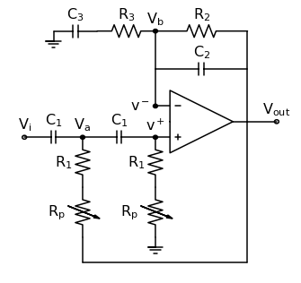

# Filter

## Top part

$$ Z_3 = R_3 + \frac{1}{C_3} $$
$$ Z_3 = \frac{R_3 C_3 s + 1}{C_3 s} $$
$$ I_3 = V_b \frac{C_3 s}{R_3 C_3 s + 1} $$

$$ Z_2 = \frac{\frac{R_2}{C_2 s}}{R_2 + \frac{1}{C_2 s}} $$
$$ Z_2 = \frac{R_2}{R_2 C_2 s + 1} $$
$$ I_2 = I_3 = (V_o - V_b) \frac{R_2 C_2 s + 1}{R_2} $$

$$ \boxed{ 
    V_b = V_0 \frac{(C_2 R_2 s + 1)(C_3 R_3 s + 1)}{C_2 C_3 R_2 R_3 s^2 + C_3(R_2 + R_3) s + C_2 R_2 s + 1}
 } $$

 ## $I_2$ Equality

$$ I_2 = \frac{V_b}{R_{1p}} = V_a \frac{C_1 s}{R_{1p} C_1 s + 1} $$

$$ V_b = V_a \frac{R_{1p} C_1 s}{R_{1p} C_1 s + 1} $$

$$ \boxed{
    V_o = V_a \frac{C_1 C_2 C_3 R_{1p} R_2 R_3 s^3 + C_1 R_{1p} (C_3 (R_2 + R_3) + C_2 R_2) s^2 + C_1 R_{1p} s}{(C_1 R_{1p} s + 1)(C_2 R_2 s + 1)(C_3 R_3 s + 1)}
} $$

$$ \boxed{
    V_a = V_o \frac{(C_1 R_{1p} s + 1)(C_2 R_2 s + 1)(C_3 R_3 s + 1)}
    {C_1 C_2 C_3 R_{1p} R_2 R_3 s^3 + C_1 R_{1p} (C_3 (R_2 + R_3) + C_2 R_2) s^2 + C_1 R_{1p} s}
} $$

## Symbols
a = R_1p
b = R_2
c = R_3
d = C_1
e = C_2
f = C_3

## Lower part

$$ I_0 + I_1 = I_2 $$

$$ (V_i - V_a) C_1 s + \frac{V_o - V_a}{R_{1p}} = V_a \frac{C_1 s}{R_{1p} C_1 s + 1} $$

$$ V_i C_1 s = V_0 \left( x \frac{C_1 s}{R_{1p} C_1 s + 1}
             - \frac{1}{R_{1p}} + \frac{x}{R_{1p}} + x C_1 s \right)$$

$$ 
    \frac{(adx + 1)(bex + 1)(cfx + 1)}{a(abcdefx^3 + adx^2 (f(b+c) + be) + adx)} - \frac{bfx}
    {a(bcefx^2 + (be + bf + cf)x + 1)}
$$

Simplify This!

((adx + 1)(bex + 1)(cfx + 1)
)/(a(abcdefx^3 + adx^2 (f(b+c) + be) + adx
))- (b f x)/(a (b c E f x^2 + (b E + b f + c f) x + 1))

a (a d x + 1) (b e x + 1) (c f x + 1) (b c e f x^2 + b e x + b f x + c f x + 1) - a^2 b d f x^2 (b c e f x^2 + b e x + b f x + c f x + 1)

Numerator: a (b c e f x^2 + b e x + b f x + c f x + 1) (a b c d e f x^3 + a b d e x^2 - a b d f x^2 + a c d f x^2 + a d x + b c e f x^2 + b e x + c f x + 1)

Denominator: a^3 d x (b c e f x^2 + b e x + b f x + c f x + 1)^2

